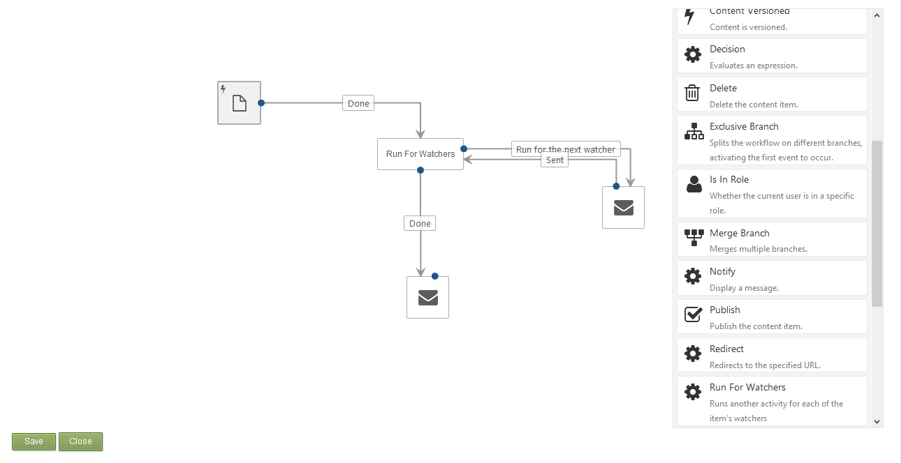

# Watcher Orchard module

## About

Orchard module for watching content items and geting notified on modifications.

## Documentation

Watcher lets you add the ability of "watching" to content items. You can watch a demo of this module [as part of an Orchard community meeting](http://youtu.be/jXr0IMgUZhk?t=41m08s).

**This module depends on [Helpful Libraries](https://github.com/Lombiq/Helpful-Libraries). Please install it first!**

After installing you can attach WatchablePart to enable watching on the items of certain content types. This will result in a "Watch" link being displayed along those items (only in Detail display type by default). Users can click that to watch an item or to remove the watching.

Watcher integrates with Workflows by adding the "Run For Watchers" activity. You can use this to hook into events watchers should be notified about and to run any other activity for each of the watchers. The below screenshot illustrates a simple setup.

Here the Watcher activity is hooked into the built-in content created event. Run For Watchers exposes two branches: "Run for the next watcher" and "Done". The former one is run for each watcher and the latter one is run once when every watcher was notified. You can see that for this you need to set up a loop: here every watcher gets an e-mail notification (and somebody on the "Done" event too); but after an e-mail is sent the control should be looped back to Run For Watchers to go on with the next watcher until all the watchers were processed.

Containers are taken into account, for three levels. This means that if you watch a content item you'll be notified on the events of the items contained by that item, items contained by those items and items contained by those items. I.e. the maximal depth: watched item -> contained item -> content item -> content item.

In the "Run for the next watcher" branch the User token is filled with the user object of the watcher. This way you can use the User tokens to e.g. send an e-mail to the watcher.

The module is also available for [DotNest](http://dotnest.com/) sites.

## Contributing and support

Bug reports, feature requests, comments, questions, code contributions, and love letters are warmly welcome, please do so via GitHub issues and pull requests. Please adhere to our [open-source guidelines](https://lombiq.com/open-source-guidelines) while doing so.

This project is developed by [Lombiq Technologies](https://lombiq.com/). Commercial-grade support is available through Lombiq.